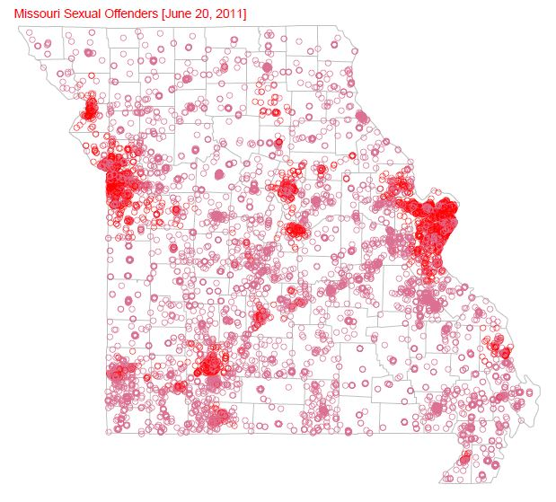

## Analysis of Missouri Sex Offender Registry Data for KSHB Actions News

In July 2011 KSHB Action News in Kansas City investigated [Loophole in law allows hundreds of Missouri sex offenders to live near church day cares](http://www.kshb.com/news/local-news/investigations/loophole-in-law-allows-hundreds-of-missouri-sex-offenders-to-live-near-church-daycares).

As an analyst for the [Franklin Center for Government and Public Integrity](http://franklincenterhq.org/) I used R scripts to process the data for KSHB.

At that time I published four technical articles about the analysis:

1. [Analysis of Missouri Sex Offender Registry Data](http://franklincenterhq.org/2536/analysis-of-missouri-sex-offender-registry-data/)
2. [Geocoding addresses from Missouri Sex Offender Registry](http://franklincenterhq.org/2541/geocoding-addresses-from-missouri-sex-offender-registry/)
3. [Computing distance matrix between Missouri sex offenders and child daycare facilities](http://franklincenterhq.org/2544/computing-distance-matrix-between-missouri-sex-offenders-and-child-daycare-facilities/)
4. [Displaying Missouri sex offender/child day care facility proximity map using batchgeo.com](http://franklincenterhq.org/2563/displaying-missouri-sex-offenderchild-day-care-facility-proximity-map-using-batchgeo-com/)

These articles contained several graphics and links to R source code showing how to process the data.

Because links to the graphics and R source code are now stale in these articles, I'm re-publishing them here. Word documents containing the original WordPress articles are included here with all the original graphics.

Use of this information is governed by the [Watchdog.org "Steal our Stuff!" policy](http://watchdog.org/steal-our-stuff/).

Summaries from the analysis:

### Missouri Sexual Offenders, June 2011

### KSHB's Interactive Map using batchgeo.com

[Loophole in law allows hundreds of Missouri sex offenders to live near church daycares](http://batchgeo.com/map/356612ae67bb92de8c91dd9fb7e27029)

